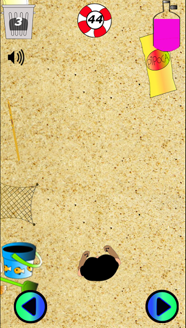
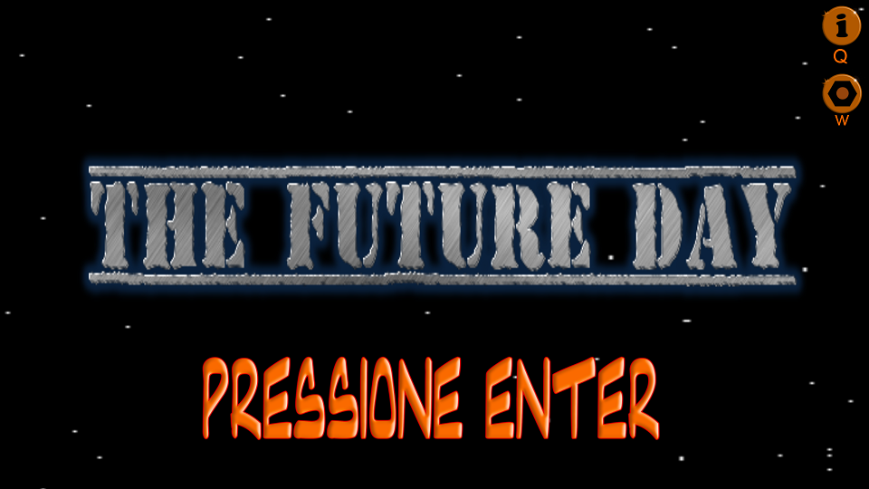
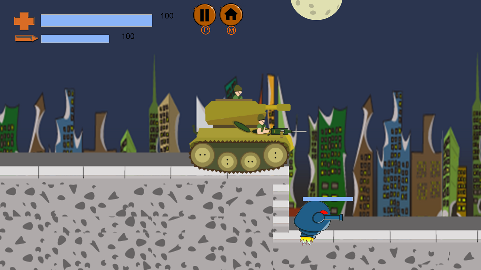
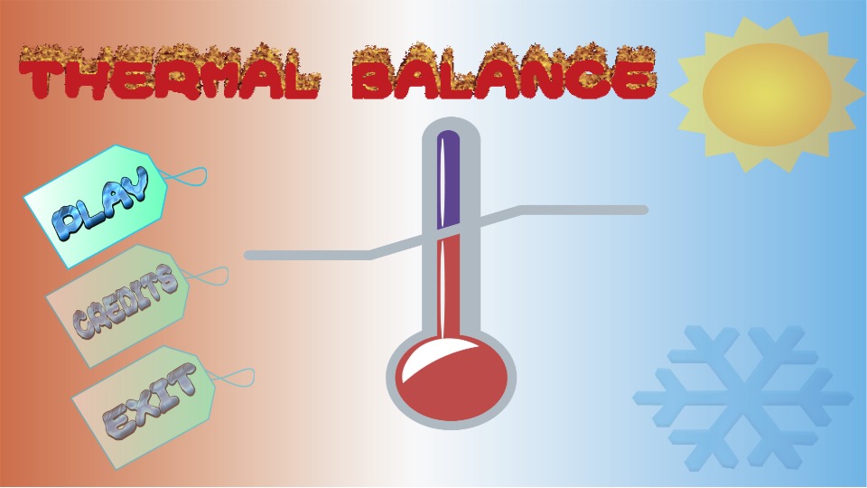
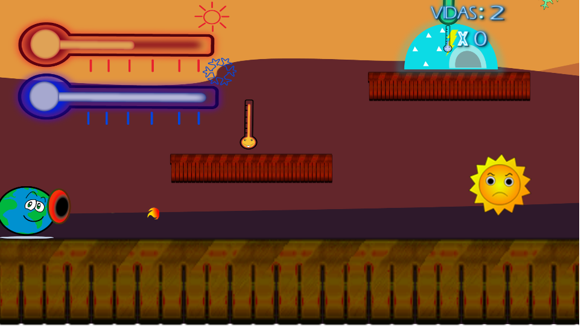
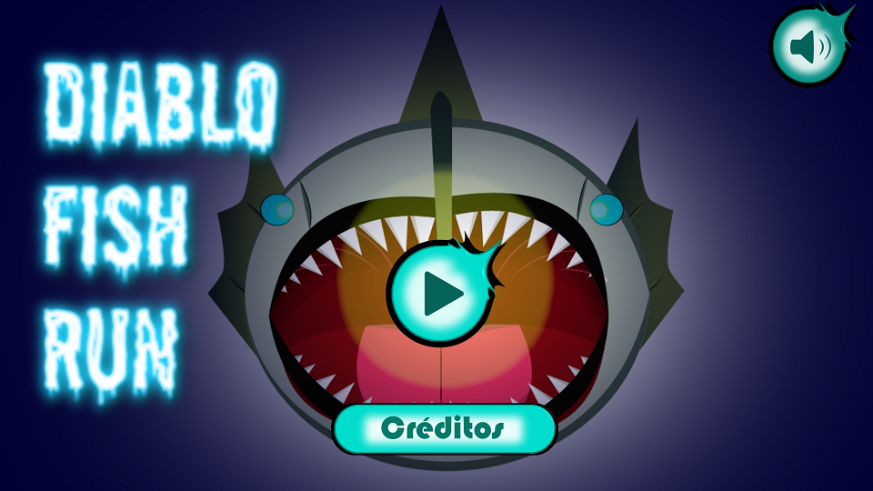
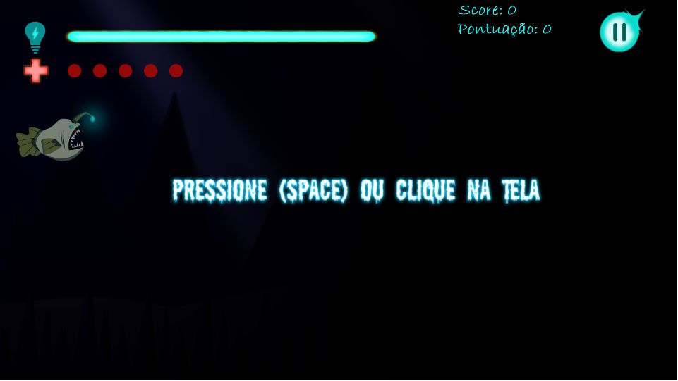
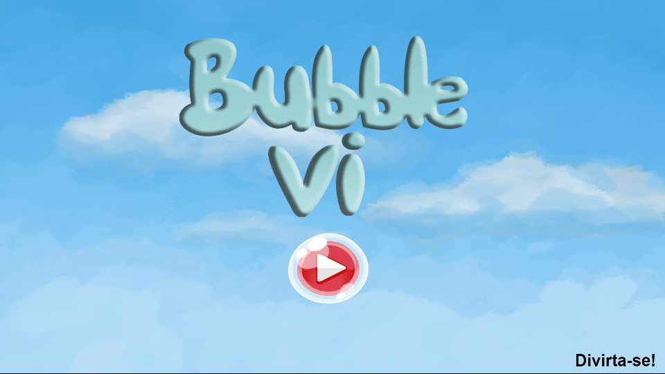
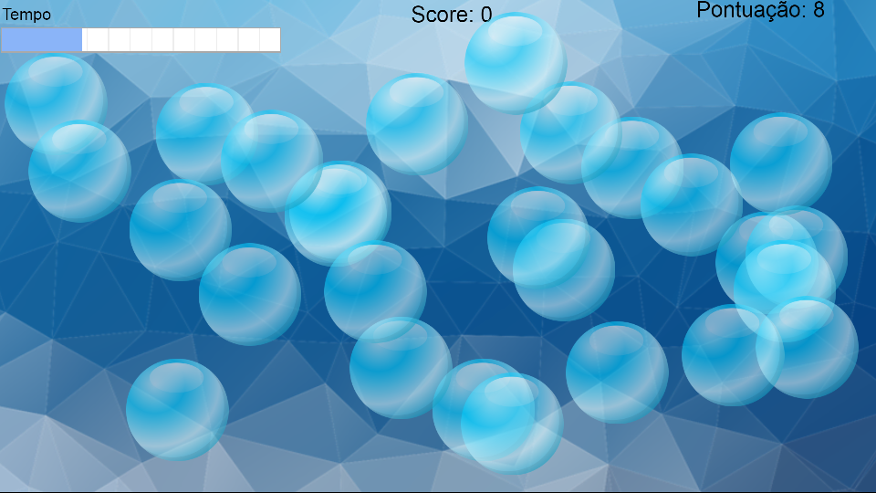

# Wesley Billy

Meu história no mundo dos Jogos Digitais!

## Bem-vindo ao meu portifólio

### Quem sou?

Meu nome é Wesley Billy, sou um amante do mundo dos jogos digitais e tudo que o rodeia, desde das histórias até a mecânica neles usada. Também sou um iniciante no mundo das ilustrações, na qual tenho uma extrema admiração por cada um dos tipos de artes. Como consequência de gostar muito desse mundo das artes em geral, aprendi a tocar violão - umas das melhores coisas que já descidir fazer. Tenho como lema que fala o seguinte: NO stress.

### Jogos
**1. Against The Flow** [Para Jogar Clique aqui](wesleybilly27.github.io/ATF/) 
    Ajude Richard a salvar sua amada filha Aurora desviando de obstáculos e coletando os lixos na praia.  
    
      

**2. The Future Day**
    A ideia do companheiro é muito presente no exercito, principalmente se eles são irmãos e ainda mais gêmeos. Então sinta-se à vontade para ajudar os irmãos a protegerem a Terra da ameaça alienígena.  
    
    
    
**3. Thermal Balance**  
    Ajude o Planeta a entrar em equilíbrio térmico, nem tão quente, nem tão frio.
    
    
    
**4. Diablo Fish Run**
    Qual o seu maior medo? O do desse peixe não é a escuridão.
      
      
    
**5. Bublle VI**
    Está estressado? Estoures essas bolhas e relaxe.  
    
    
    

# Redes socias e Contatos

 Whatsapp e número: (84) 9 9439-7500  

 Email: wesleybilly27@gmail.com
